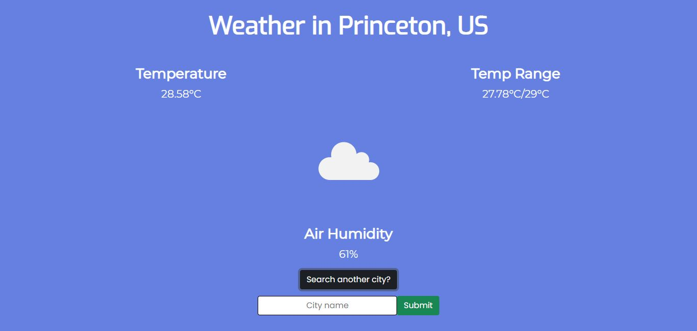

# Weather App

## Contents
- [Overview](#overview)
    - [Screenshots](#screenshots)
    - [Links](#links)
- [Built with](#built-with)
    - [Server Side](#server-side)
    - [Client Side](#client-side)
    - [APIs](#apis)
- [Author](#author)

## Overview

This application allows users to search for real-time weather data of any city or town in the world.
The search results include the real-time temperature, the expected temperature range for the day, and the relative air humidity (as a percentage), as well as a small icon to represent the overall current weather data.
After every search, the user is allowed to search a different city and get a completely different result.

### Screenshots

#### Initial site

Screenshot of the application when accessing the empty path ("/").

#### Results site

Screenshot of the application showing real-time weather results for the searched city.

### Links

- Solution URL: [Weather App Source Code](https://github.com/Jorge644240/Weather-App).

## Built With

### Server Side

- [Node.js](https://nodejs.org/en/)
- [Express](http://expressjs.com/)
- [Pug](https://pugjs.org/api/getting-started.html) (Template Engine)

### Client Side

- HTML5
- CSS3
- JavaScript ([jQuery](https://jquery.com/))

### APIs

- [Open Weather Map API](https://openweathermap.org/api)

## Author

Project created by [Jorge Gallego](https://github.com/Jorge644240)

- [Web CV](https://jorge644240.github.io/CV/)